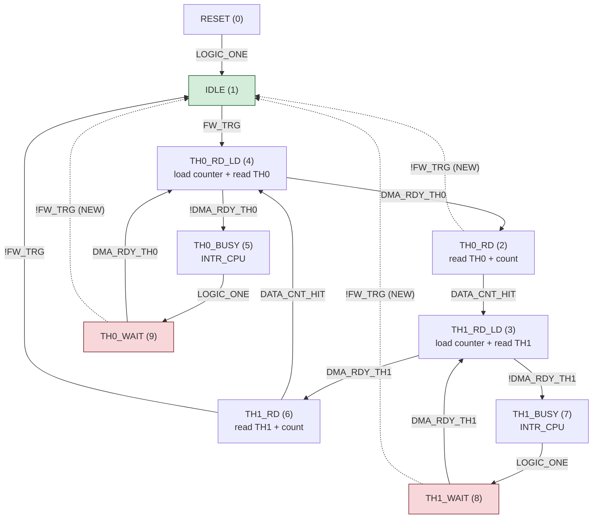

# PLAN: Add !FW_TRG exit transitions to GPIF state machine

## Problem

The GPIF II state machine (`SDDC_FX3/SDDC_GPIF.h`, designed in
`SDDC_FX3/SDDC_GPIF/projectfiles/gpif2model.xml`) has 10 states but only
**one** of them — TH1_RD (state 6) — can cleanly stop via a `!FW_TRG → IDLE`
transition.  All other active states have no `!FW_TRG` exit.

This forces every STOPFX3 command and every watchdog recovery to use
`CyU3PGpifDisable(CyTrue)` (force-stop), which kills the GPIF hardware
mid-transaction.  Force-stop from a WAIT state (the exact state the watchdog
detects as a stall) leaves DMA descriptors, PIB interface state, and socket
state in a non-deterministic condition.  The subsequent `DmaMultiChannelReset`
+ `UsbFlushEp` cannot reliably clean up after an uncontrolled abort.

Residual state corruption from force-stop causes the next streaming session to
stall sooner, producing cascading watchdog recoveries — the 239 streaming
faults observed in a 688-cycle soak run.

## Root cause: missing transitions

Current state machine transitions (from `gpif2model.xml`):

| State       | Index | Transitions out                          | Has !FW_TRG exit? |
|-------------|-------|------------------------------------------|--------------------|
| RESET       | 0     | → IDLE (LOGIC_ONE)                       | N/A (start state)  |
| IDLE        | 1     | → TH0_RD_LD (FW_TRG)                    | N/A (already idle)  |
| TH0_RD      | 2     | → TH1_RD_LD (DATA_CNT_HIT)              | **NO**              |
| TH1_RD_LD   | 3     | → TH1_RD (DMA_RDY_TH1), → TH1_BUSY (!DMA_RDY_TH1) | no        |
| TH0_RD_LD   | 4     | → TH0_RD (DMA_RDY_TH0), → TH0_BUSY (!DMA_RDY_TH0) | no        |
| TH0_BUSY    | 5     | → TH0_WAIT (LOGIC_ONE)                   | no (transient)      |
| TH1_RD      | 6     | → TH0_RD_LD (DATA_CNT_HIT), → IDLE (!FW_TRG) | **YES — the only one** |
| TH1_BUSY    | 7     | → TH1_WAIT (LOGIC_ONE)                   | no (transient)      |
| TH1_WAIT    | 8     | → TH1_RD_LD (DMA_RDY_TH1)               | **NO — dead-end**   |
| TH0_WAIT    | 9     | → TH0_RD_LD (DMA_RDY_TH0)               | **NO — dead-end**   |

The WAIT states (8, 9) are the lockup points.  When the USB host cannot drain
bulk data fast enough, DMA buffers fill, `DMA_RDY` goes inactive, and the SM
enters WAIT.  There is no timeout, no `!FW_TRG` check — the SM spins on
`DMA_RDY` forever.  The only way out is `CyU3PGpifDisable(CyTrue)`.

## Evidence from soak testing

688-cycle soak (seed 20, `--cycles 20` with 20 shuffled rounds):

- **239 streaming faults** (watchdog recoveries) — roughly 1 every 3 cycles
- **12,808 PIB errors** — BUSY-state INTR_CPU notifications from backpressure
- **4 dma_count_monotonic failures** (4/13, 31% failure rate)
  - All show `gpif=255` (SM dead / force-stopped) and `pib_arg=0x1005`
  - Predecessors vary (console_fill, debug_race, rapid_start_stop, freq_hop)
  - Failure pattern: DMA count plateaus mid-stream because GPIF was
    force-killed in a WAIT state during a prior scenario's cleanup,
    and residual corruption stalled the pipeline in the current scenario
- **All other tests pass** — the device recovers, but at the cost of constant
  watchdog churn

## Proposed state machine changes

**No additional states are needed.**  The state count remains at 10.  All three
changes add a second transition to states that currently have exactly one,
staying within the GPIF II limit of 2 transitions per state.

### State diagram (after changes)

Dashed lines are the three new `!FW_TRG → IDLE` transitions.



Green = safe stop state.  Red = dead-end states (before this change).

### Transition capacity audit

Each GPIF II state supports at most 2 outbound transitions (left/alpha =
higher priority, right/beta = lower priority).  Current usage:

| State       | Index | ElementId   | Current transitions | Slots used | Free |
|-------------|-------|-------------|---------------------|------------|------|
| RESET       | 0     | STARTSTATE1 | LOGIC_ONE → IDLE                             | 1 | 1 |
| IDLE        | 1     | STATE8      | FW_TRG → TH0_RD_LD                          | 1 | 1 |
| TH0_RD      | 2     | STATE1      | DATA_CNT_HIT → TH1_RD_LD                    | 1 | **1 free** |
| TH1_RD_LD   | 3     | STATE0      | DMA_RDY_TH1 → TH1_RD, !DMA_RDY_TH1 → TH1_BUSY | 2 | 0 |
| TH0_RD_LD   | 4     | STATE5      | DMA_RDY_TH0 → TH0_RD, !DMA_RDY_TH0 → TH0_BUSY | 2 | 0 |
| TH0_BUSY    | 5     | STATE4      | LOGIC_ONE → TH0_WAIT                        | 1 | 1 |
| TH1_RD      | 6     | STATE2      | DATA_CNT_HIT → TH0_RD_LD, !FW_TRG → IDLE   | 2 | 0 |
| TH1_BUSY    | 7     | STATE3      | LOGIC_ONE → TH1_WAIT                        | 1 | 1 |
| TH1_WAIT    | 8     | STATE6      | DMA_RDY_TH1 → TH1_RD_LD                    | 1 | **1 free** |
| TH0_WAIT    | 9     | STATE7      | DMA_RDY_TH0 → TH0_RD_LD                    | 1 | **1 free** |

The three target states (TH0_RD, TH0_WAIT, TH1_WAIT) each have exactly one
free slot.  The two states that cannot be changed (TH0_RD_LD, TH1_RD_LD) are
already at their 2-transition limit but are single-clock transient states that
immediately branch to either RD or BUSY — they are not a concern (see
"Worst-case stop latency" below).

### Change 1: TH0_WAIT → IDLE on !FW_TRG  (critical — dead-end elimination)

TH0_WAIT (state 9, ElementId STATE7) is a dead-end: the SM spins on
`DMA_RDY_TH0` with no escape.  This is one of the states the watchdog detects
and force-kills (RunApplication.c:226, `gpifState == 9`).

```
Before:  TH0_WAIT ──(DMA_RDY_TH0)──→ TH0_RD_LD
After:   TH0_WAIT ──(DMA_RDY_TH0)──→ TH0_RD_LD     [left/alpha — resume if DMA drains]
                  └──(!FW_TRG)──────→ IDLE            [right/beta — stop if told to]
```

In the Designer: add transition from STATE7 to STATE8, equation `!FW_TRG`.

**Priority rationale:** DMA_RDY_TH0 as left (higher priority) means: if DMA
becomes ready in the same cycle that !FW_TRG is seen, resume data flow.
This is the conservative choice — it avoids abandoning a buffer when the
backpressure was momentary.  The !FW_TRG exit fires only when DMA is truly
stalled AND the firmware has decided to stop.

### Change 2: TH1_WAIT → IDLE on !FW_TRG  (critical — dead-end elimination)

Identical logic for the other DMA thread.  TH1_WAIT (state 8, ElementId
STATE6) also has no exit except `DMA_RDY_TH1`.

```
Before:  TH1_WAIT ──(DMA_RDY_TH1)──→ TH1_RD_LD
After:   TH1_WAIT ──(DMA_RDY_TH1)──→ TH1_RD_LD     [left/alpha — resume]
                  └──(!FW_TRG)──────→ IDLE            [right/beta — stop]
```

In the Designer: add transition from STATE6 to STATE8, equation `!FW_TRG`.

### Change 3: TH0_RD → IDLE on !FW_TRG  (symmetry with TH1_RD)

TH1_RD already has `!FW_TRG → IDLE` (TRANSITION4 in the XML).  TH0_RD does
not.  Without this, the SM can only cleanly stop during Thread 1's read phase.
If STOPFX3 fires during Thread 0's read, the SM must fill the entire 16 KB
buffer (~128 µs at 64 MS/s), transition through TH1_RD_LD → TH1_RD, and only
then check `!FW_TRG`.

```
Before:  TH0_RD ──(DATA_CNT_HIT)──→ TH1_RD_LD
After:   TH0_RD ──(DATA_CNT_HIT)──→ TH1_RD_LD       [left/alpha — buffer full, switch thread]
                └──(!FW_TRG)───────→ IDLE              [right/beta — stop mid-buffer]
```

In the Designer: add transition from STATE1 to STATE8, equation `!FW_TRG`.

**Priority rationale:** DATA_CNT_HIT as left means: if the data counter hits
in the same cycle as !FW_TRG, finish the buffer (commit it to the DMA
channel) then stop at TH1_RD's existing !FW_TRG check.  The !FW_TRG exit
fires only when the buffer is mid-fill AND the firmware wants to stop —
the partial buffer is abandoned, same as what force-stop does today but
with the SM in a deterministic state.

### States not changed (and why)

- **TH0_RD_LD (4) / TH1_RD_LD (3):** Already at the 2-transition limit
  (DMA_RDY/!DMA_RDY).  Also single-clock transient states — the SM passes
  through in one cycle and reaches either an RD state (which now has
  !FW_TRG) or a BUSY→WAIT path (which now has !FW_TRG).
- **TH0_BUSY (5) / TH1_BUSY (7):** Transient — one clock of LOGIC_ONE →
  WAIT.  The WAIT states now have !FW_TRG exits, so the BUSY→WAIT→IDLE
  path takes at most 2 extra clocks.  Adding !FW_TRG to BUSY would skip
  the INTR_CPU action (PIB error notification), which is undesirable for
  diagnostics.
- **IDLE (1):** Already the stop state.  Its single transition (FW_TRG →
  TH0_RD_LD) only fires when FW_TRG is asserted.  When deasserted, the SM
  naturally loops in IDLE.

### Worst-case stop latency (after changes)

The SM reaches IDLE from any active state within a bounded number of clocks
after FW_TRG is deasserted:

| SM is in...    | Path to IDLE                                      | Clocks |
|----------------|---------------------------------------------------|--------|
| TH0_RD (2)     | !FW_TRG → IDLE                                   | 1      |
| TH1_RD (6)     | !FW_TRG → IDLE (existing)                        | 1      |
| TH0_WAIT (9)   | !FW_TRG → IDLE                                   | 1      |
| TH1_WAIT (8)   | !FW_TRG → IDLE                                   | 1      |
| TH0_BUSY (5)   | → TH0_WAIT → !FW_TRG → IDLE                     | 2      |
| TH1_BUSY (7)   | → TH1_WAIT → !FW_TRG → IDLE                     | 2      |
| TH0_RD_LD (4)  | → TH0_RD → !FW_TRG → IDLE                       | 2      |
|                 | or → TH0_BUSY → TH0_WAIT → !FW_TRG → IDLE       | 3      |
| TH1_RD_LD (3)  | → TH1_RD → !FW_TRG → IDLE                       | 2      |
|                 | or → TH1_BUSY → TH1_WAIT → !FW_TRG → IDLE       | 3      |

**Maximum: 3 clocks** (~47 ns at 64 MHz external clock).  This is
deterministic and instantaneous from the firmware's perspective (the 1 ms
`CyU3PThreadSleep` in STOPFX3 is orders of magnitude longer).

### Complete transition table after changes

For reference, the full SM with new transitions marked:

| # | Source → Destination | Condition | Priority | XML ID | Status |
|---|---------------------|-----------|----------|--------|--------|
| 1 | RESET → IDLE | LOGIC_ONE | left | TRANSITION3 | existing |
| 2 | IDLE → TH0_RD_LD | FW_TRG | left | TRANSITION18 | existing |
| 3 | TH0_RD_LD → TH0_RD | DMA_RDY_TH0 | left | TRANSITION21 | existing |
| 4 | TH0_RD_LD → TH0_BUSY | !DMA_RDY_TH0 | right | TRANSITION12 | existing |
| 5 | TH0_RD → TH1_RD_LD | DATA_CNT_HIT | left | TRANSITION0 | existing |
| 6 | **TH0_RD → IDLE** | **!FW_TRG** | **right** | — | **NEW** |
| 7 | TH1_RD_LD → TH1_RD | DMA_RDY_TH1 | left | TRANSITION1 | existing |
| 8 | TH1_RD_LD → TH1_BUSY | !DMA_RDY_TH1 | right | TRANSITION9 | existing |
| 9 | TH1_RD → TH0_RD_LD | DATA_CNT_HIT | left | TRANSITION2 | existing |
| 10 | TH1_RD → IDLE | !FW_TRG | right | TRANSITION4 | existing |
| 11 | TH0_BUSY → TH0_WAIT | LOGIC_ONE | left | TRANSITION13 | existing |
| 12 | **TH0_WAIT → IDLE** | **!FW_TRG** | **right** | — | **NEW** |
| 13 | TH0_WAIT → TH0_RD_LD | DMA_RDY_TH0 | left | TRANSITION17 | existing |
| 14 | TH1_BUSY → TH1_WAIT | LOGIC_ONE | left | TRANSITION10 | existing |
| 15 | **TH1_WAIT → IDLE** | **!FW_TRG** | **right** | — | **NEW** |
| 16 | TH1_WAIT → TH1_RD_LD | DMA_RDY_TH1 | left | TRANSITION11 | existing |

Total: 16 transitions (was 13).  State count: 10 (unchanged).

### Waveform descriptor sharing

The current `CyFxGpifWavedataPosition[]` maps 10 states to 8 unique
descriptors, reusing two:

```
State 8 (TH1_WAIT) → Position 2  (shares with State 2, TH0_RD)
State 9 (TH0_WAIT) → Position 1  (shares with State 1, IDLE)
```

After adding the new right-side transitions:

- **TH0_RD (pos 2) and TH1_WAIT (pos 2):** Both gain the same right
  transition (`!FW_TRG → IDLE`).  Their left transitions have different
  conditions (DATA_CNT_HIT vs DMA_RDY_TH1) but the same destination
  (TH1_RD_LD, state 3).  If the Designer can still encode these with a
  shared descriptor (the GPIF II routes different input signals per-thread),
  sharing survives.  If not, the Designer will allocate a 9th descriptor.

- **IDLE (pos 1) and TH0_WAIT (pos 1):** TH0_WAIT gains `!FW_TRG → IDLE`
  as its right transition.  IDLE would implicitly get the same right
  transition — a harmless self-loop (`!FW_TRG` means "FW_TRG not asserted",
  and IDLE already loops when FW_TRG is deasserted).  Their left transitions
  have different conditions (FW_TRG vs DMA_RDY_TH0) but the same destination
  (TH0_RD_LD, state 4).  Same sharing logic applies.

- **Worst case:** sharing breaks for both pairs → 10 unique descriptors for
  10 states.  The GPIF II supports up to 256 waveform descriptors.  Going
  from 8 to 10 is trivially within limits.

### Transition function reuse

The existing `CyFxGpifTransition[]` array already contains the `!FW_TRG`
truth table:

```c
uint16_t CyFxGpifTransition[] = {
    0x0000,   /* [0] always false         */
    0xAAAA,   /* [1] pass-through (FW_TRG, DMA_RDY) */
    0x5555,   /* [2] invert (!FW_TRG, !DMA_RDY)     */
    0xFFFF,   /* [3] LOGIC_ONE            */
    0x3333    /* [4] DATA_CNT_HIT         */
};
```

Index 2 (`0x5555`) is used by TH1_RD's existing `!FW_TRG → IDLE` transition.
All three new transitions use the same function.  **No new transition
functions are needed.**

## Firmware changes required

### 1. Regenerate SDDC_GPIF.h

Open `SDDC_FX3/SDDC_GPIF/SDDC_GPIF.cyfx` in GPIF II Designer and add:

- Transition: STATE7 (TH0_WAIT) → STATE8 (IDLE), equation: `!FW_TRG`
- Transition: STATE6 (TH1_WAIT) → STATE8 (IDLE), equation: `!FW_TRG`
- Transition: STATE1 (TH0_RD) → STATE8 (IDLE), equation: `!FW_TRG`

For each, set the new transition as the **lower-priority (right/beta)**
branch so the existing left/alpha transition takes precedence.

Regenerate the header.  Expected changes to `SDDC_GPIF.h`:
- `CyFxGpifWavedata[]`: right-side entries populated for descriptors at
  positions 1 and 2 (currently all-zeros)
- `CyFxGpifWavedataPosition[]`: may change from `{0,1,2,3,4,5,6,7,2,1}`
  to `{0,1,2,3,4,5,6,7,8,9}` if sharing breaks (or stay the same if not)
- `CyFxGpifTransition[]`: unchanged (reuses existing index 2)
- `CY_NUMBER_OF_STATES`: unchanged (still 10)

### 2. Update STOPFX3 handler (USBHandler.c:375-391)

Replace force-stop with FW_TRG-deassert + soft-stop:

```c
case STOPFX3:
    CyU3PUsbLPMEnable();
    CyU3PUsbGetEP0Data(wLength, glEp0Buffer, NULL);
    CyU3PGpifControlSWInput(CyFalse);   /* deassert FW_TRG */
    CyU3PThreadSleep(1);                /* SM reaches IDLE within 1 clock,
                                          * but sleep 1 ms for DMA quiesce */
    CyU3PGpifDisable(CyFalse);          /* soft-stop — SM is already in IDLE */
    CyU3PDmaMultiChannelReset(&glMultiChHandleSlFifoPtoU);
    CyU3PUsbFlushEp(CY_FX_EP_CONSUMER);
    glDMACount = 0;
    glWdgRecoveryCount = 0;
    isHandled = CyTrue;
    break;
```

Key change: `CyU3PGpifDisable(CyFalse)` instead of `CyU3PGpifDisable(CyTrue)`.
With the new transitions, deassert FW_TRG guarantees the SM reaches IDLE
regardless of which state it's in.  Soft-stop then disables a quiescent SM.

### 3. Update watchdog recovery (RunApplication.c:244-279)

Same pattern — deassert FW_TRG, let SM reach IDLE, then soft-stop:

```c
CyU3PGpifControlSWInput(CyFalse);     /* deassert FW_TRG */
CyU3PThreadSleep(1);                  /* SM → IDLE via new !FW_TRG transitions */
CyU3PGpifDisable(CyFalse);            /* soft-stop from IDLE */
rc_reset = CyU3PDmaMultiChannelReset(&glMultiChHandleSlFifoPtoU);
rc_flush = CyU3PUsbFlushEp(CY_FX_EP_CONSUMER);
/* ... restart as before ... */
```

### 4. Update STARTFX3 handler (USBHandler.c:337)

Currently does `CyU3PGpifDisable(CyTrue)` as a safety stop.  Change to:

```c
CyU3PGpifControlSWInput(CyFalse);   /* deassert FW_TRG in case SM is running */
CyU3PGpifDisable(CyFalse);          /* soft-stop — SM should be in IDLE or off */
```

Keep force-stop as a fallback only if soft-stop returns an error (SM stuck in
a state without the new transitions, e.g. during firmware mismatch).

## Validation

### Build

Standard FX3 SDK build.  The only generated file is `SDDC_GPIF.h`; all other
changes are in `USBHandler.c` and `RunApplication.c`.

### Test procedure

1. **Soak test with new firmware:**
   ```
   ./fx3_cmd -F ../SDDC_FX3/SDDC_FX3.img soak --cycles 20
   ```
   Run 500+ cycles.  Compare streaming_faults count to the baseline of 239/688.
   Expected: significant reduction (the SM can now exit WAIT cleanly, so
   force-stop damage is eliminated).

2. **dma_count_monotonic pass rate:**
   Baseline: 9/13 (69%).  Expected: improvement toward 13/13, since the
   residual corruption from force-stop is the suspected cause of DMA stalls.

3. **Regression: all other soak scenarios should remain at 100% pass.**
   The new transitions only add exit paths from states that previously had
   no escape — they don't change the normal data-flow path.

4. **Stop latency:**
   Verify STOPFX3 completes within the same time as before.  The worst case
   is now 1 clock cycle (SM in WAIT → IDLE on !FW_TRG) + 1 ms sleep, versus
   the previous force-stop which was also ~immediate but left debris.

### Regression risk

- **The normal streaming path is unchanged.**  The new transitions only fire
  when FW_TRG is deasserted, which only happens during STOP or watchdog
  recovery.  During normal streaming, FW_TRG is asserted and the new
  transitions are never evaluated.
- **Partial buffer discard:** When the SM exits WAIT → IDLE via !FW_TRG, any
  partially-filled DMA buffer is abandoned.  This is identical to what
  force-stop does — the difference is the SM state is now deterministic
  (in IDLE) rather than undefined.

## Files to modify

| File | Change |
|------|--------|
| `SDDC_FX3/SDDC_GPIF/projectfiles/gpif2model.xml` | Add 3 transitions in GPIF II Designer |
| `SDDC_FX3/SDDC_GPIF.h` | Regenerated from Designer (wavedata, positions, transitions) |
| `SDDC_FX3/USBHandler.c` | STOPFX3: soft-stop; STARTFX3: soft-stop |
| `SDDC_FX3/RunApplication.c` | Watchdog: soft-stop before recovery |
