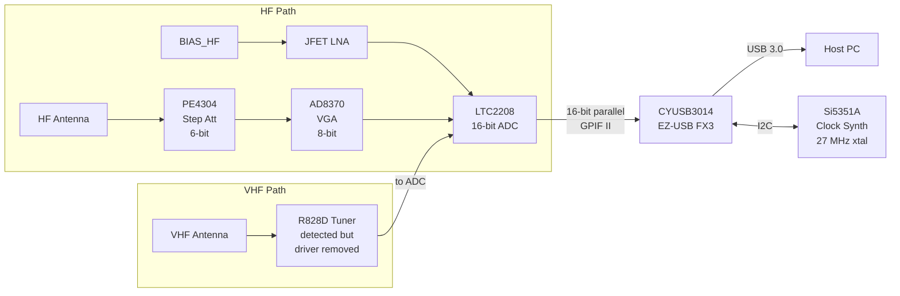
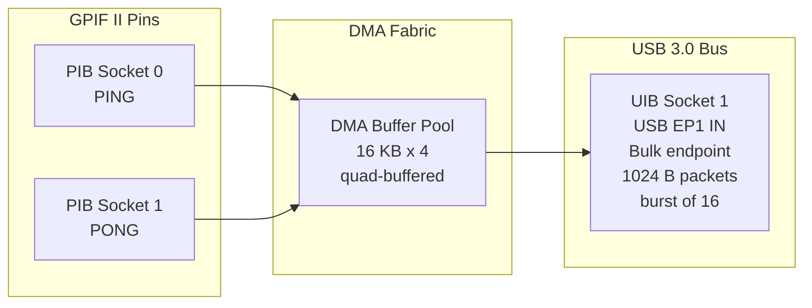
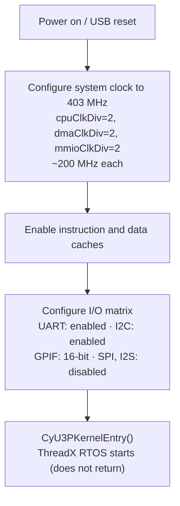
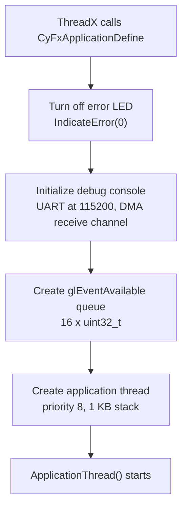
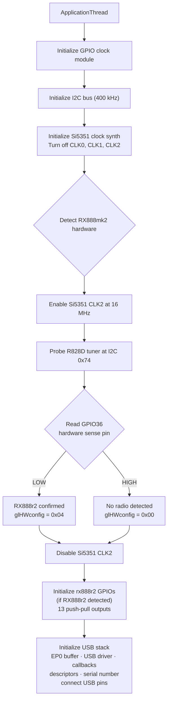
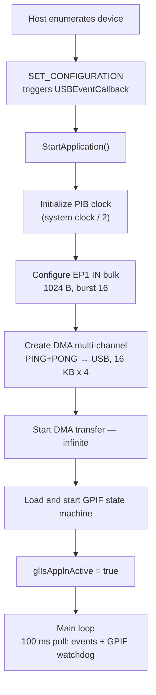

# RX888mk2 Firmware Architecture

## What the RX888mk2 is

The RX888mk2 is a wideband direct-sampling software-defined radio (SDR)
receiver.  Unlike traditional superheterodyne receivers that mix an
incoming RF signal down to an intermediate frequency before digitizing
it, the RX888mk2 feeds the antenna signal through an analog front end
and directly into a high-speed analog-to-digital converter.  The
resulting stream of raw samples is pushed over USB 3.0 to a host
computer, which performs all tuning, filtering, and demodulation in
software.

This architecture trades analog complexity for digital bandwidth: with a
16-bit ADC clocked at up to 64 MSPS (or 128 MSPS in some
configurations), the receiver can capture tens of megahertz of spectrum
in a single pass.  The host sees a continuous firehose of I/Q or
real-valued samples at roughly 128-256 MB/s -- a data rate that demands
USB 3.0 SuperSpeed and careful DMA design.

The board is manufactured as a small USB-powered dongle.  It is used for
HF amateur radio, shortwave listening, wideband spectrum monitoring,
scientific measurement, and general RF experimentation.

---

## Hardware overview

### Block diagram



### Key components

| Component | Part | Role |
|-----------|------|------|
| **USB controller** | Cypress/Infineon CYUSB3014 (EZ-USB FX3) | ARM9 SoC with USB 3.0 PHY, GPIF II, DMA engine |
| **ADC** | LTC2208 (or similar) | 16-bit, up to 130 MSPS direct-sampling converter |
| **Clock synthesizer** | Si5351A | Programmable clock generator; PLL A drives ADC sample clock, PLL B drives VHF tuner reference |
| **Step attenuator** | PE4304 | 6-bit digital attenuator, 0-31.5 dB in 0.5 dB steps |
| **Variable gain amp** | AD8370 | 8-bit programmable-gain amplifier |
| **VHF tuner** | R828D | Silicon tuner IC for VHF/UHF (detected at I2C address 0x74 during hardware identification; R82xx driver was removed from this fork due to GPL licensing) |
| **HF LNA** | JFET front-end | Bias-controlled via `BIAS_HF` GPIO |
| **Blue LED** | GPIO 21 | Status indicator; used for error blink on fatal faults |

### Signal path

**HF path (direct sampling):**
Antenna &rarr; PE4304 step attenuator &rarr; AD8370 VGA &rarr;
optional JFET LNA (controlled by `BIAS_HF`) &rarr; LTC2208 ADC &rarr;
16-bit parallel output &rarr; FX3 GPIF II pins &rarr; DMA &rarr;
USB 3.0 bulk endpoint &rarr; host.

**VHF path (tuner-assisted):**
Antenna &rarr; R828D tuner (IF output) &rarr; ADC &rarr; same path
as above.  The VHF path is selected by the `VHF_EN` GPIO.  In this
fork, the R828D driver has been removed, so VHF support requires the
host to control the tuner directly over I2C using the `I2CWFX3`/
`I2CRFX3` vendor commands.

---

## The EZ-USB FX3 (CYUSB3014)

The FX3 is the heart of the device.  It is not merely a USB-to-parallel
bridge; it is a full ARM9 system-on-chip running an RTOS, with a
programmable parallel interface and a hardware DMA fabric that can move
data from external pins to the USB bus at up to 375 MB/s without CPU
involvement.

### Chip architecture

| Feature | Specification |
|---------|---------------|
| CPU core | ARM926EJ-S, 32-bit, 200 MHz |
| Instruction TCM | 16 KB (exception vectors, ISR code) |
| Data TCM | 8 KB (stacks, hot data structures) |
| System SRAM | 512 KB (code + data; first 12 KB reserved for DMA descriptors) |
| USB PHY | Integrated USB 3.0 SuperSpeed (5 Gbps) + USB 2.0 High-Speed |
| GPIF II | Programmable parallel interface, up to 100 MHz, 8/16/32-bit data bus |
| DMA fabric | Hardware scatter-gather engine connecting all peripherals |
| Serial I/O | UART, I2C (up to 1 MHz), SPI (up to 33 MHz), I2S |
| GPIO | Up to 61 simple GPIOs + 8 complex (PWM/timer) GPIOs |
| Package | 121-ball BGA, 10 x 10 mm |
| Power | 1.2 V core, 1.8-3.3 V I/O; USB bus-powered (up to 800 mA at SuperSpeed) |
| Boot modes | USB, I2C EEPROM, SPI flash, GPIF |

### Why the FX3 matters for SDR

The critical feature is the combination of **GPIF II** and the **DMA
fabric**.  The ADC presents 16 bits of sample data on a parallel bus,
clocked at the sampling frequency.  The GPIF II state machine reads
those 16 bits on every clock edge, packs them into DMA buffers, and the
DMA engine transfers the buffers to the USB endpoint -- all without the
ARM9 CPU touching a single sample byte.  The CPU is free to handle
control commands (tuning, attenuation, GPIO) over USB endpoint zero.

This is what makes ~128 MB/s sustained throughput possible on a
microcontroller with only 512 KB of RAM: the data never enters main
memory, it flows through dedicated hardware paths from the GPIF pins
through DMA buffers directly to the USB transmit FIFO.

---

## GPIF II: the programmable parallel interface

### What GPIF II does

GPIF II (General Programmable Interface, Generation 2) is a hardware
block on the FX3 that presents a configurable set of data, address, and
control pins to the outside world.  Its behavior is defined by a
**state machine** that is programmed at runtime from firmware.

The state machine is designed using the **GPIF II Designer** tool, which
produces a C header file (`SDDC_GPIF.h`) containing register values and
waveform descriptors.  The firmware loads this configuration into the
GPIF hardware at startup via `CyU3PGpifLoad()`.

### State machine for the RX888mk2

The generated state machine in `SDDC_GPIF.h` has **10 states**:

| State | ID | Purpose |
|-------|----|---------|
| RESET | 0 | Initial state after load |
| IDLE | 1 | Waiting for software trigger |
| TH0_RD | 2 | Thread 0: read cycle |
| TH1_RD_LD | 3 | Thread 1: read with load |
| TH0_RD_LD | 4 | Thread 0: read with load |
| TH0_BUSY | 5 | Thread 0: DMA buffer full, waiting |
| TH1_RD | 6 | Thread 1: read cycle |
| TH1_BUSY | 7 | Thread 1: DMA buffer full, waiting |
| TH1_WAIT | 8 | Thread 1: waiting for buffer availability |
| TH0_WAIT | 9 | Thread 0: waiting for buffer availability |

The state machine implements a **ping-pong** buffering scheme using two
GPIF threads (Thread 0 and Thread 1).  While one thread fills a DMA
buffer with ADC samples, the other thread's completed buffer is being
transferred to the USB endpoint by the DMA engine.  If a thread's DMA
buffer is full and the DMA engine hasn't freed it yet, the state machine
enters a BUSY/WAIT state until the buffer becomes available.

This dual-threaded design is what allows continuous, gap-free streaming:
the ADC never has to stop clocking data because there is always a buffer
ready to receive it.

### GPIF threads and DMA sockets

The GPIF block has 4 hardware threads, of which this application uses 2:

| GPIF thread | DMA socket | Role |
|-------------|-----------|------|
| Thread 0 | PIB_SOCKET_0 (PING producer) | Fills DMA buffer A with ADC data |
| Thread 1 | PIB_SOCKET_1 (PONG producer) | Fills DMA buffer B with ADC data |

The data bus is configured as 16 bits wide (`isDQ32Bit = CyFalse` in
the I/O matrix), matching the 16-bit ADC output.  The GPIF clock is
derived from the system clock with a divider of 2, giving ~100 MHz at
the GPIF pins.

### Software control of GPIF

The firmware controls the GPIF via a software input signal
(`CyU3PGpifControlSWInput`).  The full start/stop lifecycle is:

**STARTFX3 (start streaming):**

1. **Preflight check** (`GpifPreflightCheck()` in
   `StartStopApplication.c`): verify Si5351 CLK0 is enabled and PLL A
   is locked.  If either fails, the command is rejected with an EP0
   STALL -- the SM would wedge permanently without the external clock
   since it has no state-count timeout.
2. `CyU3PGpifDisable(CyTrue)` -- force-stop any stuck SM from a prior
   run.
3. `CyU3PDmaMultiChannelReset()` + `SetXfer()` -- reset and re-arm the
   DMA channel.
4. `StartGPIF()` -- reload the GPIF waveform (`CyU3PGpifLoad`) and
   start the SM in IDLE (`CyU3PGpifSMStart`).
5. `CyU3PGpifControlSWInput(CyTrue)` -- assert FW_TRG to transition
   the SM from IDLE into read states; data begins flowing.

**STOPFX3 (stop streaming):**

1. `CyU3PGpifControlSWInput(CyFalse)` -- de-assert FW_TRG.  The SM
   sees `!FW_TRG` and transitions to IDLE within 3 clock cycles.
2. `CyU3PThreadSleep(1)` -- wait 1 ms for SM and DMA to quiesce.
3. `CyU3PGpifGetSMState()` -- verify SM reached IDLE (state 1).
4. If IDLE: `CyU3PGpifDisable(CyFalse)` -- disable a quiescent SM,
   preserving configuration.  If not IDLE (e.g. dead clock):
   `CyU3PGpifDisable(CyTrue)` -- force-stop fallback.
5. `CyU3PDmaMultiChannelReset()` -- reset DMA.
6. `CyU3PUsbFlushEp()` -- flush EP1 IN.

**GPIF watchdog (background recovery):**

The application thread monitors `glDMACount` every 100 ms while
streaming is active.  If the count stalls for 3 consecutive polls
(300 ms) with the SM in a BUSY/WAIT state (5, 7, 8, 9), the watchdog
tears down and rebuilds the pipeline -- same sequence as STOP + START
but initiated automatically.  If the PLL has lost lock, the watchdog
leaves the pipeline stopped and waits for the host to reconfigure.
Each recovery increments `glCounter[2]` (visible via `GETSTATS`).

A per-session **recovery cap** (`glWdgMaxRecovery`, default 5) limits
the number of consecutive watchdog recoveries before the watchdog
stops retrying and waits for an explicit `STARTFX3` from the host.
The cap counter (`glWdgRecoveryCount`) resets to zero on `STARTFX3`
and `STOPFX3` only — it does not reset when DMA resumes after a
successful watchdog recovery, so consecutive recoveries within a
session are correctly counted toward the cap.

The GPIF state machine includes `!FW_TRG → IDLE` exit transitions
on all active states that can stall, enabling clean soft-stop without
DMA debris.  STOPFX3 and the watchdog deassert FW_TRG, verify the SM
reached IDLE, then disable — falling back to force-stop only if the
external clock is dead.  See [gpif-and-recovery.md](gpif-and-recovery.md)
for the full state machine design and recovery architecture.

---

## DMA architecture

### How data flows without CPU intervention

The FX3's DMA fabric is a hardware scatter-gather engine that connects
**producer sockets** (data sources) to **consumer sockets** (data sinks)
through chains of **DMA descriptors** stored in the first 12 KB of
system SRAM.

For ADC streaming, the DMA path is:



The firmware configures this as a **`CY_U3P_DMA_TYPE_AUTO_MANY_TO_ONE`**
multi-channel:

| Parameter | Value | Meaning |
|-----------|-------|---------|
| Producer sockets | PIB_SOCKET_0, PIB_SOCKET_1 | Two GPIF threads (ping/pong) |
| Consumer socket | UIB_SOCKET_CONS_1 | USB EP1 IN |
| Buffer size | 16,384 bytes (16 x 1024) | 16 USB packets per DMA buffer |
| Buffer count | 4 | Quad-buffering for sustained throughput |
| DMA mode | Byte mode | No word-alignment restrictions |
| Transfer size | 0 (infinite) | Stream until stopped |

In AUTO mode, the DMA engine moves completed buffers from producers to
consumers without CPU intervention.  The firmware receives a
`CY_U3P_DMA_CB_PROD_EVENT` callback for each buffer completion and
increments `glDMACount`, but this is purely for monitoring -- the data
transfer happens regardless.

### DMA buffer math

At 64 MSPS, 16 bits per sample:

- Raw data rate: 64,000,000 x 2 bytes = **128 MB/s** (**1.024 Gbps**)
- USB 3.0 theoretical: 5 Gbps raw, ~3.2 Gbps effective after encoding
- Each 16 KB DMA buffer holds: 16,384 / 2 = 8,192 samples
- Buffer fill time at 64 MSPS: 8,192 / 64,000,000 = **128 us**
- With 4 buffers: **512 us** of buffering before overrun

This is why quad-buffering is necessary: the DMA engine must drain each
buffer before the GPIF fills the next one, and the USB bus must sustain
128 MB/s continuously.  Any interruption (USB link power management,
host scheduling delay, endpoint NAK) of more than ~500 us will cause a
buffer overrun and data loss.

---

## ThreadX RTOS

### What ThreadX provides

The FX3 SDK is built on **ThreadX** (now Eclipse ThreadX, formerly Azure
RTOS ThreadX), a hard real-time operating system designed for
deeply embedded microcontrollers.  Cypress licensed ThreadX and
integrated it into the FX3 SDK as the foundation for all firmware
applications.

ThreadX provides:

- **Preemptive priority-based threading** with configurable time-slicing
- **Message queues** for inter-thread communication
- **Semaphores** and **mutexes** for synchronization
- **Event flags** for signaling between threads and ISRs
- **Memory pools** (byte and block) for dynamic allocation
- **Timers** (one-shot and periodic)
- **Deterministic scheduling** with bounded context-switch time

ThreadX is notable for its small footprint (typically 2-6 KB of code)
and fast context switch time (sub-microsecond on ARM9), making it
suitable for the FX3's constrained 512 KB SRAM environment.

### How ThreadX integrates with the FX3 SDK

The RTOS is started by `CyU3PKernelEntry()`, called from the firmware's
`main()` function after hardware initialization.  This call does not
return -- it transfers control to the ThreadX scheduler, which calls
`CyFxApplicationDefine()` to let the application create its threads and
resources.

The Cypress SDK creates several internal threads for USB stack
management, DMA servicing, and debug I/O.  The application then creates
its own thread(s) alongside these.

### Thread structure in this firmware

| Thread | Creator | Priority | Stack | Role |
|--------|---------|----------|-------|------|
| System/Scheduler | ThreadX kernel | 0 | Internal | RTOS tick, idle processing |
| USB Stack | `CyU3PUsbStart()` | ~3 | Internal | USB enumeration, EP0 processing, callbacks |
| `11:HF103_ADC2USB30` | `CyFxApplicationDefine()` | 8 | 1024 B | Main application thread |

The application thread (`ApplicationThread`) runs the main firmware
loop.  It:

1. Detects hardware (Si5351, R828D, GPIO sense)
2. Initializes USB
3. Waits for enumeration
4. Polls an event queue every 100 ms for debug commands and callbacks
5. Runs the GPIF watchdog (monitors `glDMACount` for stalls during streaming)

### RTOS primitives used by this firmware

**Message queue (`CyU3PQueue`):**
`glEventAvailable` -- a 16-element queue of `uint32_t` events.  USB
callbacks, DMA callbacks, and the debug input path post events here.
The application thread consumes them in `MsgParsing()`.  Events are
packed as `(label << 24) | data`, where label identifies the source
(0 = USB event, 0x0A = user console command).

**Thread sleep (`CyU3PThreadSleep`):**
Used throughout for delays -- 100 ms polling interval in the main loop,
1000 ms after setting the ADC clock (PLL settling), 100 ms before reset,
10 ms after stopping GPIF.

**ThreadX thread introspection (`tx_thread_info_get`):**
The `threads` debug console command walks the ThreadX linked list of all
threads, printing their names.  This is a direct ThreadX API call that
bypasses the Cypress wrapper layer.

**Stack fill pattern (`0xEFEFEFEF`):**
ThreadX fills allocated thread stacks with this pattern at creation
time.  The `stack` debug console command scans from the stack base until
it finds the first undisturbed fill word, giving an estimate of peak
stack usage.

---

## Cypress/Infineon SDK

### What the SDK provides

The EZ-USB FX3 SDK (version 1.3.4, included in the `SDK/` directory) is
a layered software package from Cypress/Infineon:

| Layer | What it provides |
|-------|-----------------|
| **ThreadX RTOS** | Kernel, scheduler, thread/queue/semaphore APIs |
| **USB driver** | Full USB 3.0 device stack: enumeration, descriptor management, endpoint configuration, EP0 control transfer handling, link power management |
| **DMA framework** | Channel creation, buffer management, descriptor chains, AUTO and MANUAL transfer modes, multi-channel support |
| **GPIF II driver** | State machine loading, start/stop, software input control, state query |
| **PIB (P-port Interface Block)** | Clock configuration, socket management, error callbacks |
| **Serial peripheral drivers** | I2C master, UART, SPI, I2S |
| **GPIO driver** | Simple and complex GPIO configuration, read/write |
| **System services** | Clock configuration, cache control, device reset, watchdog, memory allocation |
| **Boot code** | ARM startup assembly (`cyfx_gcc_startup.S`), C runtime init (`cyfxtx.c`) |

### What the application developer writes

The SDK provides the infrastructure; the application developer provides
the behavior:

| Application responsibility | Files in this firmware |
|---------------------------|----------------------|
| **`main()`**: clock config, I/O matrix, start RTOS | `StartUp.c` |
| **`CyFxApplicationDefine()`**: create threads and resources | `RunApplication.c` |
| **Application thread**: hardware detection, init, main loop | `RunApplication.c` |
| **USB setup callback**: handle vendor requests | `USBHandler.c` |
| **USB event callback**: handle connect/disconnect/reset | `USBHandler.c` |
| **USB descriptors**: device identity, endpoints, strings | `USBDescriptor.c` |
| **Start/stop streaming**: configure GPIF, DMA, endpoints | `StartStopApplication.c` |
| **GPIF configuration**: state machine definition | `SDDC_GPIF.h` (generated) |
| **Hardware drivers**: clock synth, attenuator, VGA, GPIOs | `driver/Si5351.c`, `radio/rx888r2.c` |
| **Debug console**: command parser, USB debug buffer | `DebugConsole.c` |
| **I2C module**: bus initialization, transfer functions | `i2cmodule.c` |
| **Error handling**: status checking, error LED blink | `Support.c` |

### SDK calling conventions

The SDK uses a callback-driven model.  The application registers
callback functions during initialization, and the SDK invokes them from
USB stack thread context (not application thread context):

- **`CyFxSlFifoApplnUSBSetupCB`** -- called for every USB SETUP packet
  that the SDK doesn't handle automatically (vendor requests, some
  standard requests).  Runs in USB thread context.
- **`USBEventCallback`** -- called for USB bus events (connect,
  disconnect, reset, SET_CONFIGURATION).
- **`LPMRequestCallback`** -- called when the USB 3.0 host requests a
  link power state transition (U0 -> U1/U2).
- **`DmaCallback`** -- called on DMA buffer events (producer complete,
  consumer complete).

Because callbacks run in USB thread context, they must not block or
perform lengthy operations.  The firmware posts events to the
`glEventAvailable` queue for deferred processing by the application
thread.

---

## Firmware boot and initialization sequence

### Stage 1: CPU startup (`StartUp.c:main`)



### Stage 2: RTOS startup (`RunApplication.c:CyFxApplicationDefine`)



### Stage 3: Hardware detection (`RunApplication.c:ApplicationThread`)



### Stage 4: USB enumeration and streaming



---

## USB protocol: vendor commands

All control of the device happens through USB vendor requests on
endpoint zero.  The host sends a SETUP packet with a vendor-specific
`bRequest` code, and the firmware handles it in the USB setup callback
(`CyFxSlFifoApplnUSBSetupCB`).

### Command table

| bRequest | Name | Dir | wValue | wIndex | Data | Description |
|----------|------|-----|--------|--------|------|-------------|
| 0xAA | STARTFX3 | OUT | -- | -- | 4 B | Start GPIF streaming; preflight-checks PLL lock, force-stops any stuck SM, resets DMA, reloads waveform, asserts FW_TRG; STALLs if PLL unlocked |
| 0xAB | STOPFX3 | OUT | -- | -- | 4 B | Stop GPIF streaming; de-asserts FW_TRG, force-disables GPIF (no waveform reload), resets DMA, flushes EP1 |
| 0xAC | TESTFX3 | IN | debug | -- | 4 B | Query device info; returns [glHWconfig, FW_major, FW_minor, glVendorRqtCnt]; wValue=1 enables debug mode |
| 0xAD | GPIOFX3 | OUT | -- | -- | 4 B | Set GPIO state; payload is a 32-bit bitmask interpreted by `rx888r2_GpioSet()` |
| 0xAE | I2CWFX3 | OUT | I2C addr | reg addr | N B | Write N bytes to I2C device at wValue, register wIndex |
| 0xAF | I2CRFX3 | IN | I2C addr | reg addr | N B | Read N bytes from I2C device |
| 0xB1 | RESETFX3 | OUT | -- | -- | 4 B | Warm-reset the FX3; device disconnects and returns to bootloader |
| 0xB2 | STARTADC | OUT | -- | -- | 4 B | Set ADC sampling clock; payload is frequency in Hz, programs Si5351 PLL A / CLK0; STALLs EP0 if Si5351 I2C fails |
| 0xB3 | GETSTATS | IN | 0 | 0 | 26 B | Read diagnostic counters: DMA count (4), GPIF state (1), PIB errors (4), last PIB arg (2), I2C failures (4), streaming faults (4), Si5351 status (1), boot count (4), Si5351 CLK0_CONTROL (1), clk0_result (1).  See [api.md §GETSTATS](api.md) for the canonical layout. |
| 0xB6 | SETARGFX3 | OUT | value | arg_id | 1 B | Set hardware parameter; arg_id 10 = PE4304 attenuator (0-63), arg_id 11 = AD8370 VGA (0-255) |
| 0xBA | READINFODEBUG | IN | char | -- | 100 B | Debug console: wValue carries one input character (0 = none); response is buffered debug output (STALL if empty) |

### EP0 buffer overflow protection

The firmware rejects any vendor request with `wLength > 64` by stalling
EP0 before processing.  This prevents buffer overflows on `glEp0Buffer`
(which is 64 bytes).

### Error handling

For recognized commands, `isHandled` is set to `CyTrue` and the USB
stack sends a successful status phase.  For unrecognized `bRequest`
values, the firmware stalls EP0 and logs the code via `CyU3PDebugPrint`.

The `SETARGFX3` handler calls `CyU3PUsbGetEP0Data()` unconditionally
(ACKing the data phase) before checking whether `wIndex` identifies a
valid argument.  For unknown argument IDs, the handler explicitly stalls
EP0 via `CyU3PUsbStall()` and sets `isHandled = CyTrue`, producing a
single clean STALL that the host sees as a rejected command.

---

## GPIO control and the analog front end

### GPIO pin mapping

The FX3 controls the analog front end through direct GPIO manipulation.
Each pin is configured as a simple push-pull output during
`rx888r2_GpioInitialize()`:

| FX3 GPIO | Signal | Function |
|----------|--------|----------|
| 17 | ATT_LE | PE4304 attenuator latch enable |
| 18 | BIAS_VHF | VHF LNA bias (silicon MMIC) |
| 19 | BIAS_HF | HF LNA bias (JFET) |
| 20 | RANDO | ADC randomizer dither enable |
| 21 | LED_BLUE | Blue status LED |
| 24 | PGA | Programmable gain amplifier enable (**inverted**: GPIO high = PGA off) |
| 26 | ATT_DATA | Serial data to PE4304 and AD8370 (shared) |
| 27 | ATT_CLK | Serial clock to PE4304 and AD8370 (shared) |
| 28 | SHDWN | Shutdown control |
| 29 | DITH | Dither enable |
| 35 | VHF_EN | VHF receive path enable |
| 36 | SENSE | Hardware ID sense (input, active low = RX888r2) |
| 38 | VGA_LE | AD8370 VGA latch enable |

### GPIOFX3 bitmask protocol

The `GPIOFX3` command takes a 32-bit word where each bit controls a
specific function:

| Bit | Name | Active state |
|-----|------|-------------|
| 5 | SHDWN | High = shutdown |
| 6 | DITH | High = dither on |
| 7 | RANDO | High = randomizer on |
| 8 | BIAS_HF | High = HF LNA biased |
| 9 | BIAS_VHF | High = VHF LNA biased |
| 10 | *(unused)* | -- |
| 11 | LED_BLUE | High = blue LED on (GPIO 21) |
| 12 | *(unused)* | -- |
| 15 | VHF_EN | High = VHF path enabled |
| 16 | PGA_EN | **Inverted**: bit set = PGA disabled |

### Serial-shifted attenuator and VGA

The PE4304 attenuator and AD8370 VGA share the same clock and data GPIO
pins but have separate latch-enable pins.  Both use a simple
bit-banged serial protocol:

**PE4304 (6-bit, MSB first):**
1. Assert ATT_LE low
2. For each of 6 bits: set ATT_DATA, pulse ATT_CLK high then low
3. Pulse ATT_LE high then low (latch)

**AD8370 (8-bit, MSB first):**
1. Assert VGA_LE low
2. For each of 8 bits: set ATT_DATA, pulse ATT_CLK high then low
3. Pulse VGA_LE high (latch), clear ATT_DATA

---

## Clock synthesis (Si5351A)

The Si5351A is a programmable clock generator controlled over I2C
(address 0xC0).  It contains two PLLs (A and B) fed by a 27 MHz
crystal, each driving independent MultiSynth dividers:

| Output | PLL | MultiSynth | Use |
|--------|-----|-----------|-----|
| CLK0 | PLL A | MS0 | **ADC sampling clock** (host-controlled frequency) |
| CLK2 | PLL B | MS2 | VHF tuner reference clock (16 MHz during detection) |

### Frequency setting algorithm

When the host sends `STARTADC` with a target frequency:

1. If frequency is below 1 MHz, apply R-divider post-scaling (divide by
   powers of 2) and scale up the intermediate frequency
2. Calculate the integer divider: `900 MHz / frequency` (ensure even)
3. Calculate PLL frequency: `divider * frequency`
4. Decompose into integer multiplier and 20-bit fraction:
   `mult = pllFreq / 27 MHz`, `num/denom` for the fractional part
5. Program PLL A registers (8-byte I2C write)
6. Program MultiSynth 0 (8-byte I2C write)
7. Reset PLL A
8. Enable CLK0 output

Each I2C step checks the return status; if any step fails the command
STALLs EP0 and the failure is logged via `DebugPrint`.  On success the
firmware sleeps 1000 ms after programming the clock to allow the PLL
to settle.  A frequency of 0 disables CLK0 output (single I2C write).

---

## Debug infrastructure

### Two debug paths

The firmware has two independent debug channels, selected at compile
time by `_DEBUG_USB_` (defined in `protocol.h`; USB debug is the current
default):

| | UART serial | Debug-over-USB |
|---|---|---|
| Output | Physical UART TX pin at 115200 baud | `glBufDebug[100]` buffer, polled via READINFODEBUG |
| Input | UART RX via DMA callback | READINFODEBUG wValue carries one character per transfer |
| Activation | Always on when `_DEBUG_USB_` is not defined | Host must send TESTFX3 with wValue=1 |

Both paths feed into the same `glConsoleInBuffer[32]` and trigger the same
`ParseCommand()` on carriage return (0x0D).  All input is forced to
lowercase (`| 0x20`).

### Console commands

| Command | Action |
|---------|--------|
| `?` | Print help and current DMA count |
| `threads` | Walk ThreadX thread list, print all thread names |
| `stack` | Scan application thread stack for free space |
| `gpif` | Query GPIF II state machine current state |
| `reset` | Warm-reset the FX3 device |

### Vendor request tracing

When `TRACESERIAL` is defined (currently enabled in `Application.h`),
every vendor request except READINFODEBUG is logged via
`TraceSerial()`, printing the command name and relevant parameters
through whichever debug output channel is active.

---

## What the host side needs to do

The firmware handles the device-side half of the system.  To actually
receive and use RF data, a host application must:

### 1. Upload firmware

The FX3 boots into a USB bootloader (VID 0x04B4, PID 0x00F3) with no
application firmware.  The host must upload `SDDC_FX3.img` via the
bootloader's vendor protocol.  The `rx888_stream` tool from the
[rx888_tools](https://github.com/ringof/rx888_tools) repository handles
this with its `-f` flag.  After upload, the device re-enumerates with
PID 0x00F1.

### 2. Control the receiver

Using USB vendor requests (typically via libusb), the host:

1. **Queries the device** (`TESTFX3`) to confirm hardware type and
   firmware version.
2. **Sets the ADC clock** (`STARTADC`) to the desired sampling rate.
3. **Configures the analog front end** (`GPIOFX3`) to enable LNA bias,
   dither, randomizer, and select HF or VHF path.
4. **Sets attenuation and gain** (`SETARGFX3`) to optimize the signal
   level for the ADC's dynamic range.
5. **Starts streaming** (`STARTFX3`) to begin the flow of ADC samples.

### 3. Receive the sample stream

Once streaming is started, the device continuously pushes 16-bit ADC
samples through the USB 3.0 bulk endpoint (EP1 IN, address 0x81).  The
host must:

- Submit bulk transfer requests (typically using libusb asynchronous
  transfers for sustained throughput)
- Maintain multiple in-flight transfers to keep the USB bus saturated
- Process or buffer the received data at the full data rate

The sample format is raw 16-bit values (typically unsigned or
offset-binary, depending on the ADC configuration) at whatever rate the
Si5351 CLK0 was programmed to.

### 4. Stop and clean up

The host sends `STOPFX3` to halt streaming, optionally `RESETFX3` to
return the device to bootloader mode, and releases the USB interface.

### Host software ecosystem

Several host applications can work with this device:

| Software | Platform | Interface | Description |
|----------|----------|-----------|-------------|
| **rx888_stream** | Linux | libusb | Command-line streaming tool; firmware upload, raw sample capture |
| **fx3_cmd** | Linux | libusb | Individual vendor command exerciser for testing and debugging |
| **HDSDR** | Windows | ExtIO DLL | General-purpose SDR application using the ExtIO plugin interface |
| **SDR#** | Windows | ExtIO DLL | Popular SDR application with waterfall display |
| **ExtIO_sddc** | Windows | ExtIO DLL | The original Windows plugin from which this firmware was extracted |

The **ExtIO** interface is a Windows DLL plugin standard used by SDR
applications.  An ExtIO DLL provides functions like `OpenHW()`,
`StartHW()`, `SetHWLO()`, and a callback for delivering samples.  The
DLL handles all USB communication internally, presenting a clean
abstraction to the SDR application.  The firmware in this repository was
originally part of the ExtIO_sddc project by Oscar Steila (IK1XPV) and
has been extracted into a standalone firmware project for the RX888mk2
hardware variant.

---

## Build system

### Firmware build

```
cd SDDC_FX3 && make clean && make all
```

**Requirements:**
- `arm-none-eabi-gcc` (ARM bare-metal cross-compiler)
- `gcc` (native, to build the `elf2img` utility)
- `make`
- Cypress FX3 SDK 1.3.4 (included in `SDK/`)

**Build steps:**
1. Compile all `.c` sources and the `.S` startup assembly with the ARM
   cross-compiler, using SDK headers and link scripts
2. Link into `SDDC_FX3.elf`
3. Build `elf2img` from `SDK/util/elf2img/elf2img.c` (native GCC)
4. Convert ELF to `SDDC_FX3.img` (Cypress boot image format)

The `.img` file is what gets uploaded to the device.

### Host tools build

```
cd tests && make
```

Builds `fx3_cmd` (vendor command exerciser) and optionally `rx888_stream`
(from the rx888_tools submodule).  Requires `libusb-1.0-dev`.

### Test suite

```
./tests/fw_test.sh --firmware SDDC_FX3/SDDC_FX3.img
```

The test harness uses TAP (Test Anything Protocol) format, uploads
firmware via `rx888_stream -f`, waits for re-enumeration, then exercises
every vendor command through `fx3_cmd`.

---

## Source file reference

| File | Lines | Purpose |
|------|-------|---------|
| `SDDC_FX3/StartUp.c` | 82 | ARM entry point, clock config, I/O matrix, RTOS start |
| `SDDC_FX3/RunApplication.c` | 362 | Application thread, hardware detection, main loop, GPIF watchdog |
| `SDDC_FX3/USBHandler.c` | 574 | USB setup callback (all vendor commands), USB init |
| `SDDC_FX3/StartStopApplication.c` | 212 | GPIF/DMA/endpoint configuration, start/stop streaming, preflight check |
| `SDDC_FX3/DebugConsole.c` | 349 | UART init, debug buffer, console parser, USB debug |
| `SDDC_FX3/USBDescriptor.c` | 299 | USB descriptors (SS, HS, FS, BOS, strings, serial number) |
| `SDDC_FX3/Support.c` | 185 | Error code lookup, status checking, error LED blink |
| `SDDC_FX3/i2cmodule.c` | 90 | I2C master init and transfer functions |
| `SDDC_FX3/driver/Si5351.c` | 328 | Si5351 clock synthesizer: PLL setup, frequency calculation, lock status |
| `SDDC_FX3/radio/rx888r2.c` | 89 | RX888mk2 hardware abstraction: GPIO, attenuator, VGA |
| `SDDC_FX3/Application.h` | 96 | Central header: includes, defines, prototypes |
| `SDDC_FX3/protocol.h` | 84 | USB protocol: vendor request codes, GPIO enums, arguments |
| `SDDC_FX3/SDDC_GPIF.h` | 173 | Generated GPIF II state machine configuration |
| `SDDC_FX3/cyfxtx.c` | -- | Cypress SDK memory and TX runtime support |
| `SDDC_FX3/cyfx_gcc_startup.S` | -- | ARM GCC startup assembly (vectors, stack init) |
| `tests/fx3_cmd.c` | 4990 | Host-side vendor command exerciser, soak test harness (libusb) |
| `tests/fw_test.sh` | 731 | TAP test harness for automated firmware testing (36 tests + 3 streaming) |
