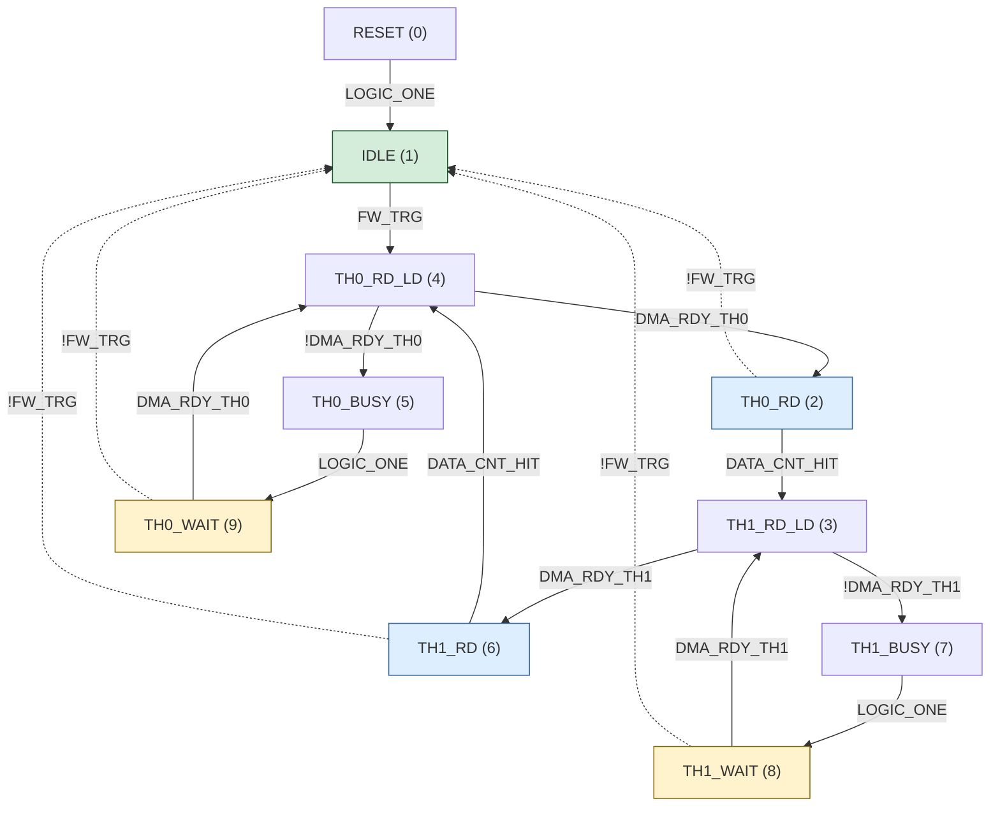

# GPIF State Machine and Recovery Architecture

This document describes the GPIF II state machine design, the soft-stop
mechanism, and the layered recovery architecture that keeps the RX888mk2
firmware streaming reliably under adverse conditions.

For general firmware architecture, see [architecture.md](architecture.md).
For clock-loss detection specifics, see [wedge_detection.md](wedge_detection.md).

---

## GPIF II state machine

The GPIF II block on the FX3 is a programmable parallel interface whose
behavior is defined by a state machine loaded at runtime from
`SDDC_GPIF.h`.  The state machine is designed in the Cypress GPIF II
Designer tool and regenerated whenever the design changes.

### States

The state machine has 10 states implementing a ping-pong buffering
scheme across two DMA threads:

| State | Index | Purpose |
|-------|-------|---------|
| RESET | 0 | Initial state after `CyU3PGpifLoad` |
| IDLE | 1 | Waiting for FW_TRG assertion |
| TH0_RD | 2 | Thread 0: read ADC data + count |
| TH1_RD_LD | 3 | Thread 1: load data counter + read |
| TH0_RD_LD | 4 | Thread 0: load data counter + read |
| TH0_BUSY | 5 | Thread 0: DMA buffer full, fire INTR_CPU |
| TH1_RD | 6 | Thread 1: read ADC data + count |
| TH1_BUSY | 7 | Thread 1: DMA buffer full, fire INTR_CPU |
| TH1_WAIT | 8 | Thread 1: waiting for DMA buffer |
| TH0_WAIT | 9 | Thread 0: waiting for DMA buffer |

While one thread fills a DMA buffer with ADC samples, the other
thread's completed buffer is transferred to the USB endpoint by the DMA
engine.  If a thread's buffer is full and the DMA engine hasn't freed it,
the SM enters BUSY (fires INTR_CPU for diagnostics) then WAIT (polls
DMA_RDY until a buffer is available).

### Transitions

The state machine has 16 transitions:



Green = stop state.  Blue = read states.  Yellow = wait states.
Dashed lines = `!FW_TRG` exit transitions (stop paths).

### Normal data flow

When FW_TRG is asserted, the SM cycles through the read states:

```
IDLE → TH0_RD_LD → TH0_RD → TH1_RD_LD → TH1_RD → TH0_RD_LD → ...
```

Each RD state reads 16-bit ADC samples into the current thread's DMA
buffer while incrementing the data counter.  When DATA_CNT_HIT fires
(8190 samples = 16380 bytes per buffer), the SM switches threads.
The DMA engine transfers the completed buffer to the USB endpoint
while the other thread begins filling.

If the host falls behind draining USB and DMA buffers fill up,
DMA_RDY deasserts and the SM enters the BUSY → WAIT path for that
thread.  The BUSY state fires INTR_CPU (incrementing PIB error
counter 0x1005 visible via GETSTATS) before transitioning to WAIT,
where the SM polls DMA_RDY until a buffer frees up.

### Transition priorities

Each GPIF II state supports at most 2 transitions: left/alpha
(higher priority) and right/beta (lower priority).  When both
conditions are true simultaneously, the left transition wins.

The `!FW_TRG` exits are always the right/beta (lower priority)
transition.  This means:

- In read states: if DATA_CNT_HIT and !FW_TRG fire in the same
  cycle, the buffer is completed before stopping.
- In wait states: if DMA_RDY and !FW_TRG fire in the same cycle,
  the SM resumes data flow rather than stopping.  The !FW_TRG exit
  only fires when DMA is truly stalled AND the firmware wants to stop.

### Transition function table

```c
uint16_t CyFxGpifTransition[] = {
    0x0000,   /* [0] always false             */
    0xAAAA,   /* [1] pass-through (FW_TRG, DMA_RDY)   */
    0x5555,   /* [2] invert (!FW_TRG, !DMA_RDY)       */
    0xFFFF,   /* [3] LOGIC_ONE                */
    0x3333    /* [4] DATA_CNT_HIT             */
};
```

All `!FW_TRG` transitions use index 2 (`0x5555`).  No new transition
functions were needed when the stop transitions were added.

### Waveform descriptor sharing

The 10 states map to 8 unique waveform descriptors via
`CyFxGpifWavedataPosition`:

```c
uint8_t CyFxGpifWavedataPosition[] = {
    0, 1, 2, 3, 4, 5, 6, 7, 2, 6
};
```

Two pairs share descriptors because they have identical transition
destinations:

- **Position 2**: TH0_RD (state 2) and TH1_WAIT (state 8) — both go
  to state 3 (alpha) and state 1/IDLE (beta via !FW_TRG).
- **Position 6**: TH1_RD (state 6) and TH0_WAIT (state 9) — both go
  to state 4 (alpha) and state 1/IDLE (beta via !FW_TRG).

### Complete transition table

| # | Source → Destination | Condition | Priority | XML ID |
|---|---------------------|-----------|----------|--------|
| 1 | RESET → IDLE | LOGIC_ONE | left | TRANSITION3 |
| 2 | IDLE → TH0_RD_LD | FW_TRG | left | TRANSITION18 |
| 3 | TH0_RD_LD → TH0_RD | DMA_RDY_TH0 | left | TRANSITION21 |
| 4 | TH0_RD_LD → TH0_BUSY | !DMA_RDY_TH0 | right | TRANSITION12 |
| 5 | TH0_RD → TH1_RD_LD | DATA_CNT_HIT | left | TRANSITION0 |
| 6 | TH0_RD → IDLE | !FW_TRG | right | TRANSITION7 |
| 7 | TH1_RD_LD → TH1_RD | DMA_RDY_TH1 | left | TRANSITION1 |
| 8 | TH1_RD_LD → TH1_BUSY | !DMA_RDY_TH1 | right | TRANSITION9 |
| 9 | TH1_RD → TH0_RD_LD | DATA_CNT_HIT | left | TRANSITION2 |
| 10 | TH1_RD → IDLE | !FW_TRG | right | TRANSITION4 |
| 11 | TH0_BUSY → TH0_WAIT | LOGIC_ONE | left | TRANSITION13 |
| 12 | TH0_WAIT → TH0_RD_LD | DMA_RDY_TH0 | left | TRANSITION17 |
| 13 | TH0_WAIT → IDLE | !FW_TRG | right | TRANSITION5 |
| 14 | TH1_BUSY → TH1_WAIT | LOGIC_ONE | left | TRANSITION10 |
| 15 | TH1_WAIT → TH1_RD_LD | DMA_RDY_TH1 | left | TRANSITION11 |
| 16 | TH1_WAIT → IDLE | !FW_TRG | right | TRANSITION6 |

### States without !FW_TRG exits (and why)

- **TH0_RD_LD (4) / TH1_RD_LD (3)**: Already at the 2-transition
  limit (DMA_RDY / !DMA_RDY).  These are single-clock transient
  states — the SM passes through in one cycle and reaches either an
  RD state (which has !FW_TRG) or a BUSY → WAIT path (WAIT has
  !FW_TRG).
- **TH0_BUSY (5) / TH1_BUSY (7)**: Transient — one clock of
  LOGIC_ONE → WAIT.  Adding !FW_TRG would skip the INTR_CPU action
  that provides PIB error diagnostics.  The WAIT states have
  !FW_TRG exits, so BUSY → WAIT → IDLE takes at most 2 clocks.
- **IDLE (1)**: Already the stop state.  When FW_TRG is deasserted,
  the SM naturally loops in IDLE.

### Worst-case stop latency

After FW_TRG is deasserted, the SM reaches IDLE within a bounded
number of external clock cycles:

| SM is in... | Path to IDLE | Clocks |
|-------------|--------------|--------|
| TH0_RD (2) | !FW_TRG → IDLE | 1 |
| TH1_RD (6) | !FW_TRG → IDLE | 1 |
| TH0_WAIT (9) | !FW_TRG → IDLE | 1 |
| TH1_WAIT (8) | !FW_TRG → IDLE | 1 |
| TH0_BUSY (5) | → TH0_WAIT → !FW_TRG → IDLE | 2 |
| TH1_BUSY (7) | → TH1_WAIT → !FW_TRG → IDLE | 2 |
| TH0_RD_LD (4) | → TH0_RD → IDLE, or → BUSY → WAIT → IDLE | 2–3 |
| TH1_RD_LD (3) | → TH1_RD → IDLE, or → BUSY → WAIT → IDLE | 2–3 |

**Maximum: 3 clocks** (~47 ns at 64 MHz).  The 1 ms
`CyU3PThreadSleep` in the firmware stop handlers is orders of
magnitude longer than the SM needs.

### GPIF II Designer project

The state machine source files live in `SDDC_FX3/SDDC_GPIF/`:

| File | Purpose |
|------|---------|
| `SDDC_GPIF.cyfx` | Designer project file |
| `projectfiles/gpif2model.xml` | State machine model (states + transitions) |
| `projectfiles/gpif2view.xml` | Visual layout for the Designer GUI |
| `projectfiles/gpif2timingsimulation.xml` | Timing simulation parameters |

The Designer generates `SDDC_FX3/SDDC_GPIF.h`, which contains the
waveform descriptors, position mapping, transition functions, and
register values loaded by `CyU3PGpifLoad()`.

---

## Soft-stop mechanism

### The problem with force-stop

`CyU3PGpifDisable(CyTrue)` kills the GPIF hardware immediately,
regardless of what the state machine is doing.  If the SM is
mid-transaction (actively reading ADC data or waiting for DMA), the
force-stop leaves DMA descriptors, PIB interface state, and socket
state in a non-deterministic condition.

The subsequent `CyU3PDmaMultiChannelReset` + `CyU3PUsbFlushEp` cannot
reliably clean up after an uncontrolled abort.  Residual state
corruption causes the next streaming session to stall sooner,
producing cascading watchdog recoveries.

### How soft-stop works

The `!FW_TRG` exit transitions allow a controlled shutdown:

1. **Deassert FW_TRG**: `CyU3PGpifControlSWInput(CyFalse)`.  The SM
   sees !FW_TRG on the next clock edge and transitions to IDLE.
2. **Wait for SM to settle**: `CyU3PThreadSleep(1)` — 1 ms, far
   longer than the 3-clock worst case.
3. **Verify SM state**: `CyU3PGpifGetSMState()` — confirm the SM
   reached state 1 (IDLE).
4. **Disable**: `CyU3PGpifDisable(CyFalse)` — disable a quiescent
   SM.  The `CyFalse` parameter preserves the GPIF configuration so
   it can be restarted with just `CyU3PGpifSMStart`.
5. **Fallback**: If the SM did not reach IDLE (e.g. the external
   clock is dead), fall back to `CyU3PGpifDisable(CyTrue)`.

### Soft-stop in firmware code

**STOPFX3 handler** (`USBHandler.c`):

```c
CyU3PGpifControlSWInput(CyFalse);
CyU3PThreadSleep(1);
{
    uint8_t smState = 0xFF;
    CyU3PGpifGetSMState(&smState);
    if (smState == 1 /* IDLE */) {
        CyU3PGpifDisable(CyFalse);
    } else {
        DebugPrint(4, "\r\nSTP soft-stop fail SM=%d, forcing", smState);
        CyU3PGpifDisable(CyTrue);
    }
}
```

**Watchdog recovery** (`RunApplication.c`): same pattern, with the
additional caveat that soft-stop requires the external clock to
advance the SM.  If `si5351_clk0_enabled()` or `si5351_pll_locked()`
return false, the SM cannot transition and force-stop is the only
option.

**STARTFX3 handler** (`USBHandler.c`): always uses
`CyU3PGpifDisable(CyTrue)` because `StartGPIF()` calls
`CyU3PGpifLoad()` which reloads the configuration regardless.
Using `CyFalse` here provided no benefit and caused device crashes
during soak testing when the SM hadn't reached IDLE.

### Why the normal streaming path is unaffected

The `!FW_TRG` transitions only fire when FW_TRG is deasserted.
During normal streaming, FW_TRG is asserted and the !FW_TRG
condition is never true.  The SM follows exactly the same read path
it always did.

---

## Layered recovery architecture

The firmware implements four layers of recovery, from lightest to
heaviest.  Each layer handles failures that the layer above cannot.

### Layer 1: Soft-stop (STOPFX3 / watchdog)

**Trigger**: Host issues STOPFX3, or watchdog detects DMA stall.

**Action**: Deassert FW_TRG → SM exits to IDLE → disable GPIF →
reset DMA → flush USB endpoint.

**Latency**: ~1 ms (dominated by `CyU3PThreadSleep`, not the SM).

**What it fixes**: Normal stop/start cycles, backpressure-induced
stalls, routine watchdog recoveries.  Leaves no residual state
because the SM is in IDLE when disabled.

### Layer 2: Force-stop fallback

**Trigger**: Soft-stop fails — SM did not reach IDLE after FW_TRG
deassert (dead clock, PLL unlock, unexpected SM state).

**Action**: `CyU3PGpifDisable(CyTrue)` — kills GPIF hardware
unconditionally.  Wipes configuration; requires `CyU3PGpifLoad` to
restart.

**Latency**: ~1 ms.

**What it fixes**: Hardware faults where the external clock is not
running and the SM cannot advance to IDLE.  This is the last resort
before requiring host intervention.

### Layer 3: Watchdog recovery

**Trigger**: `glDMACount` stops advancing for 3 consecutive 100 ms
polls while the SM is in a BUSY or WAIT state (states 5, 7, 8, 9).

**Action**: Soft-stop (with force-stop fallback) → DMA channel
reset → USB endpoint flush → if clock is healthy: DMA re-arm →
GPIF reload and restart → reassert FW_TRG.

**Latency**: ~300 ms (stall detection) + ~1 ms (recovery).

**Recovery cap**: Limited to `WDG_MAX_RECOVERY_DEFAULT` (5)
consecutive recoveries per session.  After the cap is reached, the
watchdog stops retrying and waits for the host to issue STARTFX3.
The cap prevents unbounded recovery loops when the host is not
draining data (application crash, abandoned stream).  The cap
counter resets on STARTFX3 and STOPFX3.

**What it fixes**: DMA pipeline wedges caused by transient USB
backpressure, xHCI endpoint ring issues, or momentary clock glitches.

### Layer 4: Host restart

**Trigger**: Application decides to restart (timeout on bulk read,
GETSTATS shows stale dma_count, or scheduled reconfiguration).

**Action**: STOPFX3 → STARTFX3.  Resets all pipeline state: DMA
channels, GPIF configuration (full reload), counters, and watchdog
recovery cap.

**Latency**: ~100 ms (including USB control transfer round-trips).

**What it fixes**: Everything that the watchdog cannot — including
the state after the watchdog cap is reached, firmware-level
configuration errors, and frequency changes that require ADC clock
reprogramming.

### Recovery hierarchy summary

| Layer | Trigger | Action | Latency | Leaves debris? |
|-------|---------|--------|---------|----------------|
| Soft-stop | STOPFX3 / watchdog | FW_TRG deassert → IDLE → disable | ~1 ms | No |
| Force-stop | Soft-stop failure | `CyU3PGpifDisable(CyTrue)` | ~1 ms | Possible |
| Watchdog | DMA stall 300 ms | Tear down + rebuild pipeline | ~300 ms | No (uses soft-stop) |
| Host restart | Application decision | STOPFX3 + STARTFX3 | ~100 ms | No (full reset) |

### What cannot be recovered

- **USB disconnect**: The FX3 re-enumerates; the host must re-open
  the device.
- **Firmware crash**: The FX3 falls back to DFU bootloader mode
  (PID 0x00F3); the host must re-upload firmware.
- **Hardware fault**: Dead ADC, broken clock crystal, or damaged
  FX3.  No software recovery is possible.

---

## Soak test evidence

The recovery architecture was validated with a randomized soak test
(`fx3_cmd soak`) that exercises 39 scenarios including streaming,
stop/start cycling, clock manipulation, I2C under load, EP0 stress,
and deliberate fault injection.

### Before soft-stop (force-stop only)

688 cycles, seed 20:

- 239 streaming faults (watchdog recoveries)
- 4 dma_count_monotonic failures (31% failure rate)
- All failures show GPIF state 255 (SM killed mid-transaction)
- Cascading recovery pattern: force-stop debris from one scenario
  stalls the next

### After soft-stop

534 cycles, seed 20:

- 0 device crashes (534/534 health checks passed)
- 0 stop_start_cycle failures (51/51)
- 0 dma_count_monotonic failures (10/10)
- 0 dma_count_reset failures (11/11)
- 0 sustained_stream failures (8/8, 99% throughput)
- GPIF state consistently 1 (IDLE) at stop, never 255
- 37 of 39 scenarios at 100% pass rate

The two remaining failure scenarios (`abandoned_stream`,
`watchdog_cap_observe`) were caused by a test harness bug that
disabled the watchdog recovery cap, not a firmware issue.

### Running the soak test

The soak test requires an RX888mk2 connected via USB with firmware
loaded.  Build the test tools, then run:

```
cd tests && make
sudo ./fx3_cmd soak 1 20
```

Arguments: `soak [hours] [seed] [max_scenarios]`.  The default is 1
hour with a random seed.  `seed 20` is the baseline used for the
before/after comparison above.  The test runs 39 weighted-random
scenarios in a loop, with a health check (TESTFX3 + GETSTATS) between
each one.  Press Ctrl-C for an early summary.

The 1-hour soak with seed 20 passed with **zero device crashes** and
**100% health-check pass rate** across 500+ cycles on the current
firmware.

---

## Source file reference

| File | Recovery-related code |
|------|----------------------|
| `SDDC_FX3/SDDC_GPIF.h` | Generated waveform with !FW_TRG transitions |
| `SDDC_FX3/SDDC_GPIF/projectfiles/gpif2model.xml` | State machine source (16 transitions) |
| `SDDC_FX3/USBHandler.c` | STOPFX3 soft-stop, STARTFX3 force-stop, recovery cap reset |
| `SDDC_FX3/RunApplication.c` | Watchdog detection loop, watchdog recovery with soft-stop |
| `SDDC_FX3/StartStopApplication.c` | `StartGPIF()`, `GpifPreflightCheck()` |
| `SDDC_FX3/protocol.h` | `WDG_MAX_RECOVERY_DEFAULT` (5) |
| `SDDC_FX3/driver/Si5351.c` | `si5351_clk0_enabled()`, `si5351_pll_locked()` |
| `tests/fx3_cmd.c` | Soak test harness, `gpif_soft_stop`, `stop_under_backpressure` |
