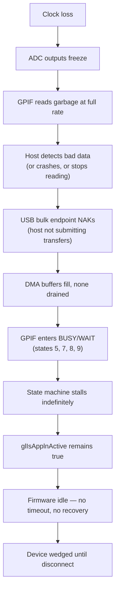
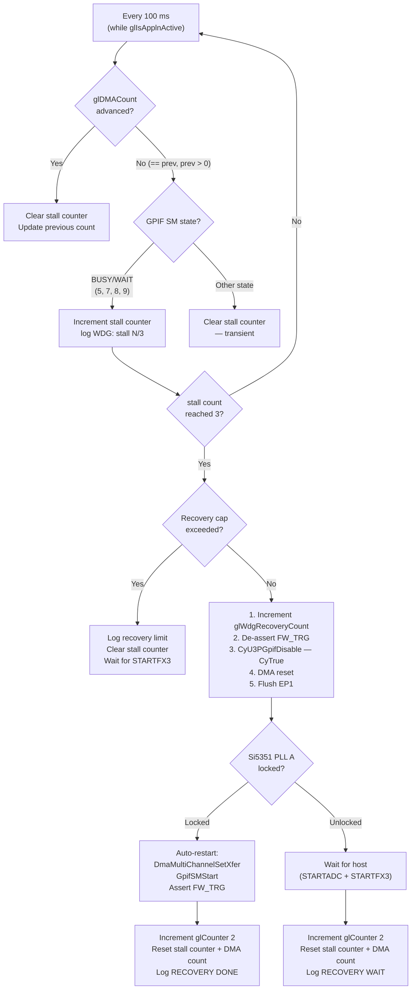

# GPIF Clock Loss Detection and Wedge Recovery

## The problem

When the ADC sampling clock disappears mid-stream (Si5351 PLL unlock,
I2C programming failure, power glitch), the original firmware and host
streamer software enter a deadlocked state with no recovery path short
of physically unplugging the device.

This document explains why the wedge happens, what detection mechanisms
the FX3 SDK provides, and how the firmware now implements a
stop-and-wait recovery.

This doc covers the GPIF (streaming) slice of wedge detection only.
The broader recovery cascade in the firmware also handles EP0
vendor-handler hangs (Level 4 device reset) and main-thread death
(Level 5 FX3 HWDT) — see
[README §Firmware Robustness](https://github.com/ringof/rx888-firmware#firmware-robustness)
for the canonical cross-layer view.  The GPIF streaming watchdog
described below is currently independent of `SDDC_FX3/health.c` and
lives in `SDDC_FX3/RunApplication.c`; migrating it behind
`health_evaluate()` / `health_recover(WEDGED_STREAMING)` is tracked
as issue #115.

---

## What happens when the ADC clock disappears

The GPIF state machine is clocked by the **internal** FX3 system clock
(`CY_U3P_SYS_CLK / 2`, ~100 MHz), not by the external ADC clock from
the Si5351.  When CLK0 stops:

1. The ADC's 16-bit parallel data outputs **freeze** at their last
   sampled value.
2. The GPIF state machine keeps running at full internal speed, reading
   the **same frozen values** every cycle.
3. DMA buffers fill normally with repeating garbage data.
4. The USB bulk stream continues -- the host receives a firehose of
   identical sample values.

The GPIF does not stall on clock loss.  It has no way to distinguish
"real ADC samples clocked by a working Si5351" from "stale pin values
read at the internal clock rate."

### How this becomes a wedge

The deadlock occurs as a **secondary failure** when the data path backs
up:



The firmware now implements a watchdog and preflight check to break
this chain (see "Implemented recovery" below).

---

## Detection mechanisms available in the FX3 SDK

### 1. PIB error callback (DMA-level error detection)

The SDK provides `CyU3PPibRegisterCallback()` with the
`CYU3P_PIB_INTR_ERROR` interrupt type.  The callback receives a 16-bit
argument encoding both PIB and GPIF error codes:

```c
CyU3PPibErrorType pibErr  = CYU3P_GET_PIB_ERROR_TYPE(cbArg);
CyU3PGpifErrorType gpifErr = CYU3P_GET_GPIF_ERROR_TYPE(cbArg);
```

**Relevant PIB errors** (per-thread, shown for Thread 0; Thread 1
equivalents exist at offset +8):

| Code | Name | Meaning |
|------|------|---------|
| 0x05 | `CYU3P_PIB_ERR_THR0_WR_OVERRUN` | Write beyond available buffer -- DMA can't drain fast enough |
| 0x12 | `CYU3P_PIB_ERR_THR0_SCK_INACTIVE` | Socket went inactive during transfer |
| 0x13 | `CYU3P_PIB_ERR_THR0_ADAP_OVERRUN` | DMA adapter overrun -- data rate exceeds DMA throughput |

**Relevant GPIF errors:**

| Code | Name | Meaning |
|------|------|---------|
| 0x1000 | `CYU3P_GPIF_ERR_DATA_WRITE_ERR` | Write to DMA thread that isn't ready |
| 0x2000 | `CYU3P_GPIF_ERR_INVALID_STATE` | State machine reached an invalid state |

These catch the **secondary failure** (DMA congestion after the host
stops reading), not the clock loss itself.

**Implementation:** The callback is registered in `StartApplication()`
(`SDDC_FX3/StartStopApplication.c`):
```c
CyU3PPibRegisterCallback(PibErrorCallback, CYU3P_PIB_INTR_ERROR);
```

The callback body (`PibErrorCallback`, same file) increments
`glCounter[0]`, saves the error argument in `glLastPibArg`, and posts
the event to the `glEventAvailable` queue where `MsgParsing()` prints
it to the debug console as `"PIB error 0x..."`.

### 2. DMA buffer count monitoring

The DMA callback increments `glDMACount` on every buffer completion
(`CY_U3P_DMA_CB_PROD_EVENT`).  The application thread loops every
100 ms.  By comparing `glDMACount` across iterations, the firmware
detects:

- **Count stopped advancing:** DMA is stalled (USB host stopped
  reading, or GPIF stopped producing).
- **Count advancing too slowly:** Data rate is wrong (clock frequency
  incorrect or intermittent).
- **Count advancing too fast:** Internal clock is driving garbage
  through faster than expected (possible if ADC clock is absent and
  the GPIF reads stale values at 100 MHz instead of the expected
  64 MHz).

**Expected rates** at common sample rates:

| Sample rate | Buffer fill time (16 KB / 2 B per sample) | Buffers/sec |
|------------|-------------------------------------------|-------------|
| 64 MSPS | 128 us | ~7,812 |
| 32 MSPS | 256 us | ~3,906 |
| 16 MSPS | 512 us | ~1,953 |
| 4 MSPS | 2.048 ms | ~488 |

At 100 ms polling interval, even the slowest rate produces ~48 buffers
per interval.  A zero-delta is an unambiguous stall indicator.

**Implementation:** The GPIF watchdog in
`SDDC_FX3/RunApplication.c`'s `ApplicationThread()` main loop uses
`glDMACount` delta == 0 as the first trigger condition.  The count
must also be > 0 (streaming has started) to avoid false triggers
on idle devices.

### 3. GPIF state machine polling

`CyU3PGpifGetSMState()` returns the current state index.  The state
machine for this application has 10 states:

| State | ID | Indicates |
|-------|----|-----------|
| IDLE | 1 | Not streaming (normal when stopped) |
| TH0_RD / TH1_RD | 2, 6 | Actively reading ADC data (healthy) |
| TH0_RD_LD / TH1_RD_LD | 4, 3 | Reading with buffer load (healthy) |
| **TH0_BUSY** | **5** | Thread 0 buffer full, waiting for DMA drain |
| **TH1_BUSY** | **7** | Thread 1 buffer full, waiting for DMA drain |
| **TH0_WAIT** | **9** | Thread 0 waiting for buffer availability |
| **TH1_WAIT** | **8** | Thread 1 waiting for buffer availability |

**Implementation:** The GPIF watchdog checks the SM state as its
second trigger condition.  A stall is only counted when `glDMACount`
has not advanced **and** the SM is in one of the four backpressure
states (5, 7, 8, 9).  If DMA stalls but the SM is in a healthy read
state, the stall counter is cleared — the slowdown is transient.

This is also accessible interactively via the `gpif` debug console
command (`DebugConsole.c`) and via `GETSTATS` byte offset 4.

### 4. Si5351 PLL lock status (proactive clock verification)

The Si5351A has a Device Status register at **I2C address 0, register
0** with the following bits:

| Bit | Name | Meaning |
|-----|------|---------|
| 7 | SYS_INIT | Device is initializing (not ready) |
| 6 | LOL_B | PLL B has lost lock |
| 5 | LOL_A | PLL A has lost lock |

Since PLL A / CLK0 drives the ADC sampling clock, reading bit 5
directly tells you whether the clock is running.  This is a **proactive**
check that detects the root cause (clock failure) rather than the
symptom (DMA stall).

**Implementation:** Used in two places:

1. **Pre-flight check** (`GpifPreflightCheck()` in
   `SDDC_FX3/StartStopApplication.c`): called before every `STARTFX3`.
   Verifies CLK0 is enabled (`si5351_clk0_enabled()`) and PLL A is
   locked (`si5351_pll_locked()`).  If either fails, `STARTFX3` is
   rejected with an EP0 STALL.

2. **Watchdog recovery** (in `RunApplication.c`'s watchdog block):
   after tearing down the pipeline, the watchdog reads PLL lock
   status.  If locked, it auto-restarts streaming.  If unlocked, it
   leaves the pipeline stopped and waits for the host to reconfigure.

3. **GETSTATS** (`USBHandler.c`): the Si5351 status register is
   sampled at read time and returned as byte 19 of the GETSTATS
   response, giving the host continuous visibility into PLL health.

### Possible future improvements (not implemented)

The following mechanisms are available in the FX3 SDK but have not been
implemented.  They are documented here as design notes for reference.

#### 5. GPIF event callback

`CyU3PGpifRegisterCallback()` can deliver events including:

- `CYU3P_GPIF_EVT_SM_INTERRUPT` -- requires the state machine to be
  redesigned to fire `INTR_CPU` on error conditions (e.g., stuck in
  BUSY too long)
- `CYU3P_GPIF_EVT_DATA_COUNTER` -- requires a data counter configured
  to fire at a throughput threshold

These require changes to the GPIF state machine (via GPIF II Designer)
and are more invasive than the polling approaches above.

#### 6. GPIF state machine redesign — `!FW_TRG` exit transitions

**Status: implemented.**  See
[gpif-and-recovery.md](gpif-and-recovery.md) for the full design.

The original SM had a critical asymmetry: only TH1_RD (state 6) had
a `!FW_TRG → IDLE` transition.  Three additional `!FW_TRG → IDLE`
transitions were added to states that each had one free transition
slot:

| State | Existing transition | Added |
|-------|-------------------|-------|
| TH0_RD (2) | `DATA_CNT_HIT → TH1_RD_LD` | `!FW_TRG → IDLE` |
| TH0_WAIT (9) | `DMA_RDY_TH0 → TH0_RD_LD` | `!FW_TRG → IDLE` |
| TH1_WAIT (8) | `DMA_RDY_TH1 → TH1_RD_LD` | `!FW_TRG → IDLE` |

De-asserting FW_TRG now guarantees the SM reaches IDLE within 3 clock
cycles (~47 ns at 64 MHz) from any active state.  STOPFX3 and the
watchdog use `CyU3PGpifDisable(CyFalse)` (soft-stop) when the SM
reaches IDLE, falling back to `CyU3PGpifDisable(CyTrue)` only when the
external clock is dead.  Soak testing (500+ cycles) confirmed zero
device crashes with this architecture.

---

## Implemented recovery

### GPIF watchdog (in `SDDC_FX3/RunApplication.c`)

The application thread runs a watchdog inside the existing 100 ms
polling loop.  The detection and recovery sequence is:



### Pre-flight check (in `SDDC_FX3/StartStopApplication.c`)

Every `STARTFX3` vendor command runs `GpifPreflightCheck()` before
touching the GPIF:

```c
if (!si5351_clk0_enabled()) {
    DebugPrint(4, "\r\nPreflight FAIL: ADC clock not enabled");
    return CyFalse;
}
if (!si5351_pll_locked()) {
    DebugPrint(4, "\r\nPreflight FAIL: Si5351 PLL_A not locked");
    return CyFalse;
}
return CyTrue;
```

If the check fails, the `STARTFX3` handler stalls EP0 and sets
`isHandled = CyTrue`.  The host sees a rejected command and can retry
after reprogramming the clock via `STARTADC`.

### Host notification

The host is informed of watchdog recovery events through:

1. **GETSTATS counter** -- `glCounter[2]` (offset 15-18) increments
   on each watchdog recovery.  Readable via `fx3_cmd stats`.
2. **Debug-over-USB** -- if `glFlagDebug` is enabled, `WDG:` prefixed
   messages appear in the `READINFODEBUG` buffer.
3. **Stream gap** -- the host observes a gap in the bulk transfer
   stream, which it can interpret as a recovery event.

---

## Implementation status

| Priority | Change | Lives in | Detection latency |
|----------|--------|----------|-------------------|
| **1** | PIB error callback: log + post event to app thread | `SDDC_FX3/StartStopApplication.c` (`PibErrorCallback`) | ~ms (interrupt-driven) |
| **2** | `glDMACount` delta check in watchdog | `SDDC_FX3/RunApplication.c` (watchdog block) | 100-300 ms (polling) |
| **3** | Si5351 PLL lock check before STARTFX3 (preflight) | `SDDC_FX3/StartStopApplication.c` (`GpifPreflightCheck`) | N/A (pre-flight) |
| **4** | GPIF state polling in watchdog (BUSY/WAIT detection) | `SDDC_FX3/RunApplication.c` (watchdog block) | 100-300 ms (polling) |
| **5** | Si5351 PLL lock check during recovery | `SDDC_FX3/RunApplication.c` (watchdog recovery) | 300 ms (after 3 stall polls) |
| **5b** | Watchdog recovery cap (`glWdgMaxRecovery`) | `SDDC_FX3/RunApplication.c` (watchdog cap counter) | N/A (limit, not detection) |
| **6** | Add `!FW_TRG → IDLE` transitions to GPIF SM | `SDDC_FX3/SDDC_GPIF.h`; see [gpif-and-recovery.md](gpif-and-recovery.md) | <1 clock (~16 ns) |

All priorities are implemented.  The silent wedge is now a
detected-and-recovered condition.  Priority 6 (soft-stop via
`CyU3PGpifDisable(CyFalse)`) was validated by a 500+ cycle soak run
at zero device crashes — see
[gpif-and-recovery.md §Soft-stop landing: before/after evidence](gpif-and-recovery.md#soft-stop-landing-beforeafter-evidence)
for the comparison numbers.  Current firmware-wide soak status lives
in the [README](https://github.com/ringof/rx888-firmware#firmware-robustness)
and `CHANGELOG.md`.

### Relationship to the broader recovery cascade

The streaming watchdog described above is the **Level 1** of the
firmware's five-level recovery cascade.  Levels 4 (EP0 vendor-handler
wedge → device reset) and 5 (main-thread death → FX3 hardware
watchdog) are implemented in `SDDC_FX3/health.c` and cover wedge
classes the GPIF watchdog cannot see.  See
[README §Firmware Robustness](https://github.com/ringof/rx888-firmware#firmware-robustness)
for the cross-layer view.

Today the GPIF watchdog is **independent** of `health.c` — it lives
in `RunApplication.c`'s main loop and owns its own state.  Migrating
it behind the `health_evaluate` / `health_recover(WEDGED_STREAMING)`
interface is tracked as issue #115.
